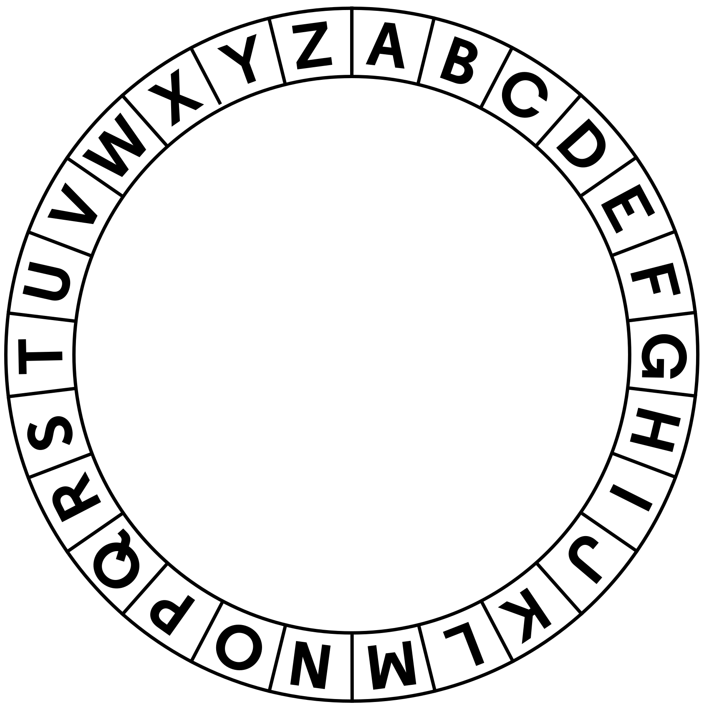
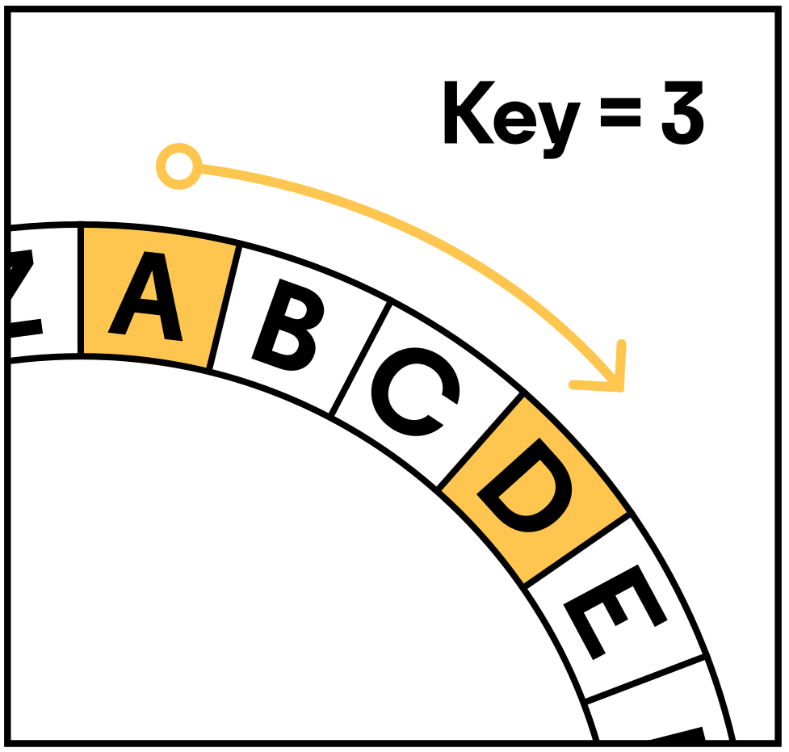

# Caesar's Cipher Encryption in Swift

## Overview
The Caesar's Cipher is a simple and historic encryption technique named after Julius Caesar, who used it to encode military secrets. This Swift program demonstrates how to encrypt a message by shifting each letter three places to the right in the alphabet.



## How it Works
1. **Alphabet Circle:** Represent the alphabet in a circular fashion.
2. **Shift by Three:** Take each letter in the input message and shift it three places to the right in the alphabet.
3. **Encryption:** The result is the encrypted message.

   

## Usage
1. Open the `CaesarCipher.swift` file in a Swift-compatible environment.
2. Replace the `inputMessage` variable with your desired message to be encrypted.
3. Run the program.
4. The encrypted message will be printed as the output.

## Example
**Input:**
``` Hello, World! ```
**Output:**
``` Khoor, Zruog! ```

## Notes
- Only letters are encrypted; other characters (such as punctuation or numbers) remain unchanged.
- The program is case-sensitive; uppercase letters are shifted separately from lowercase letters.

Feel free to experiment with different messages and explore how the Caesar's Cipher encrypts them!
